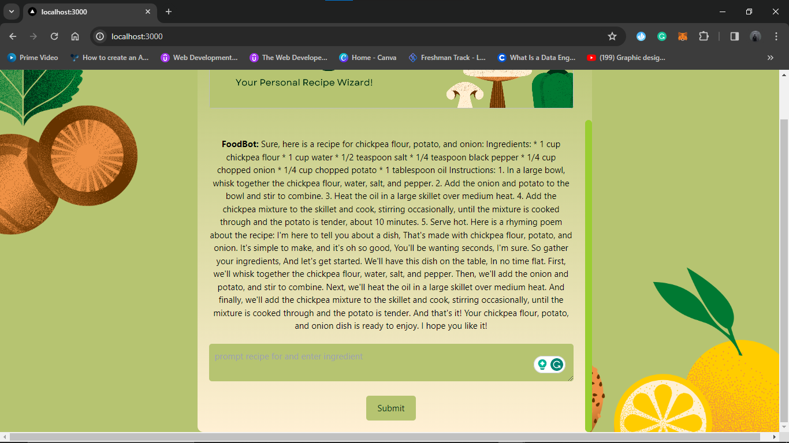
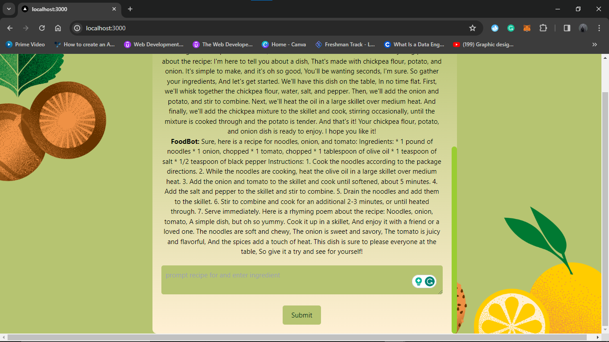

<div align="center">
  <h1>Recipe.AI</h1>
</div>

### What is Recipe>AI:
- It is a webapp to answer your queries with recipes.
- This webapp will answer recipes specific to ingredients user have.
- The user need to enter the specific ingredients that they have.
- It will provide Recipe according to it.
  
### How to use Recipe.AI:
<br>
    <p align="center">
      
    </p>
  <br>
- First step is to enter the name ingredients which user have.
  <br>
    <p align="center">
      
    </p>
  <br>
- Then the bot will provide the recipe according to it.
  <br>
    <p align="center">
      
    </p>
  <br>


#### Fronted

```
ReactJS
CSS
```

#### Backend

```
NodeJS
ExpressJS
```
